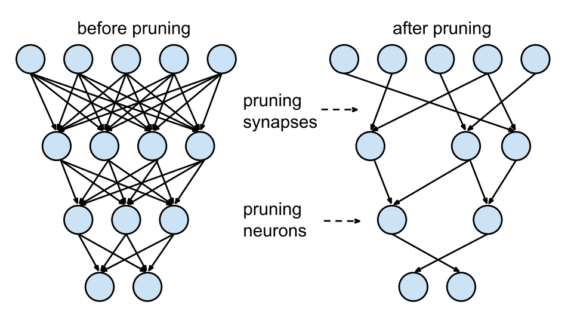
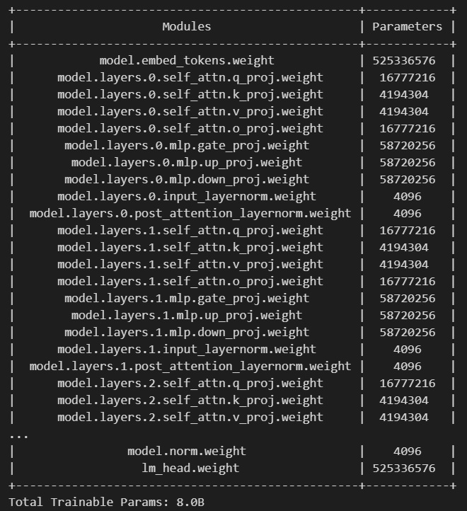
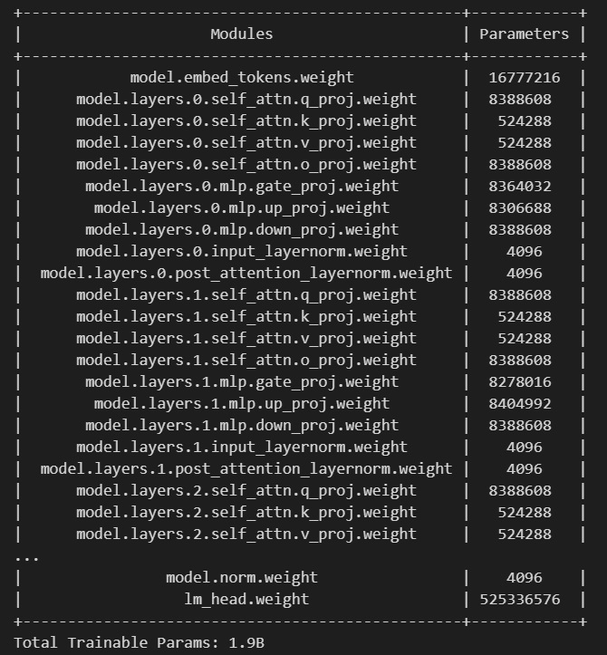

# Pruning and Quantization for LLMs (PAQLLM)

In this notebook, I'll be showing the results before and after results for each pruning & quantization

## 1) Intro
LLMs consume
1) High latency during inference
2) High Memory
3) Large Storage
4) High Power Consumption
5) Time Consuming Training Time

Due to the above reasons, we need pruning and quantization to fix those issues

## 2) References
1) Used llama 3.0 8B as the LLM
2) Used gaming laptop of GTX 1060i 6GB & 32GB of RAM
3) Used M2 NVMe (Samsung PM961 NVMe MZVLW512HMJP) hard disk

## 3) Quantization
Quantization is the process of converting a continuous signal into a discrete signal

Technique used:
- 4 bit quantization for the weights only
  
Pros for using quantization:
1) less memory usage
2) faster inference and fine-tuning time
3) less sotrage

### Quantization Storage
65% less storage is needed after quantization

### Quantization Memory
82.5% less memory is needed after quantization

### Quantization Inference time / Latency
98.81% less time is needed during inference

### Quantization Parameters
Same number of parameters but the difference is the number of bits to resemble it is now 4-bits instead of 32-bits

### Another remarks
Accuracy is not affected by any means

## 4) Pruning
Pruning is the process of removing the least important nodes and weights from the network

Technique used
- magnitude-based importance pruning (reported below & code is pushed "absolute_norm")
- Channel pruning (not reported below but code is pushed & being updated)

### Pruning Storage
80% less storage is needed after pruning

### Pruning Memory
54.04% less memory is needed after pruning

### Pruning Inference time / Latency
96.71% less time is needed during inference

### Quantization Parameters
Same number of parameters but the difference is the number of bits to resemble it is now 4-bits instead of 32-bits

### Another remarks
Accuracy is affected BUT...
Needs iterative pruning and training to keep accuracy the same as the original LLM

